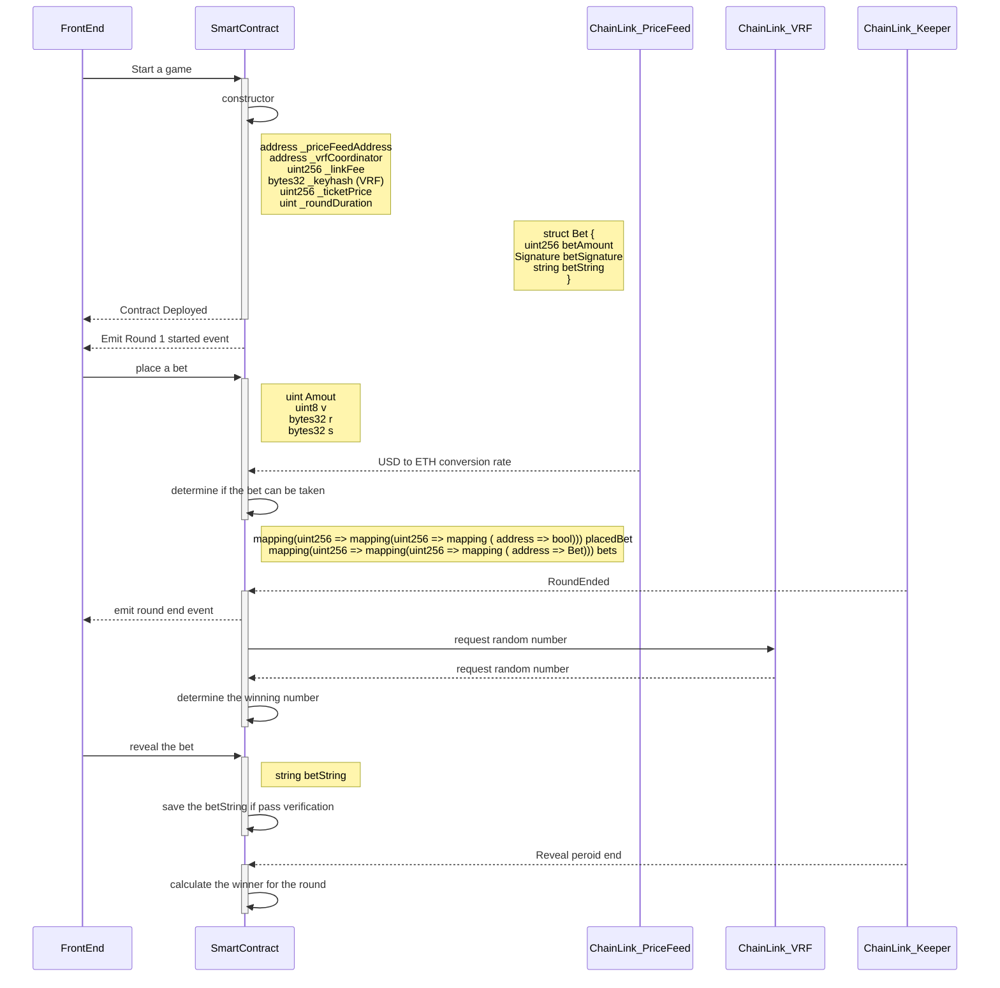

# CryptoJenga

## Chainlink features used
- Price feed
- VRF
- Keeper

```mermaid
sequenceDiagram
    participant FrontEnd
    participant SmartContract
    participant ChainLink_PriceFeed
    participant ChainLink_VRF
    participant ChainLink_Keeper

    FrontEnd->>+SmartContract: Start a game
    SmartContract->>SmartContract: constructor 

    Note right of SmartContract: address _priceFeedAddress <br/>address _vrfCoordinator <br>uint256 _linkFee<br>bytes32 _keyhash (VRF)<br>uint256 _ticketPrice<br>uint _roundDuration
   Note left of ChainLink_PriceFeed:   struct Bet {<br>uint256 betAmount<br>Signature betSignature<br>string betString<br>}
 
    SmartContract -->> -FrontEnd: Contract Deployed

    SmartContract -->> FrontEnd: Emit Round 1 started event

    FrontEnd ->> +SmartContract: place a bet
    Note right of SmartContract: uint Amout <br/>uint8 v<br>bytes32 r<br>bytes32 s;
    ChainLink_PriceFeed -->>SmartContract: USD to ETH conversion rate
    SmartContract ->>-SmartContract: determine if the bet can be taken
    Note right of SmartContract:mapping(uint256 => mapping(uint256 => mapping ( address => bool))) placedBet<br> mapping(uint256 => mapping(uint256 => mapping ( address => Bet))) bets

    ChainLink_Keeper-->>+SmartContract: RoundEnded
    SmartContract-->>FrontEnd: emit round end event
    SmartContract->>ChainLink_VRF: request random number
    ChainLink_VRF-->>SmartContract: request random number
    SmartContract ->>-SmartContract: determine the winning number

    FrontEnd ->> +SmartContract: reveal the bet
    Note right of SmartContract: string betString
    SmartContract ->>-SmartContract: save the betString if pass verification

    ChainLink_Keeper-->>+SmartContract: Reveal peroid end
    SmartContract->>-SmartContract: calculate the winner for the round
```