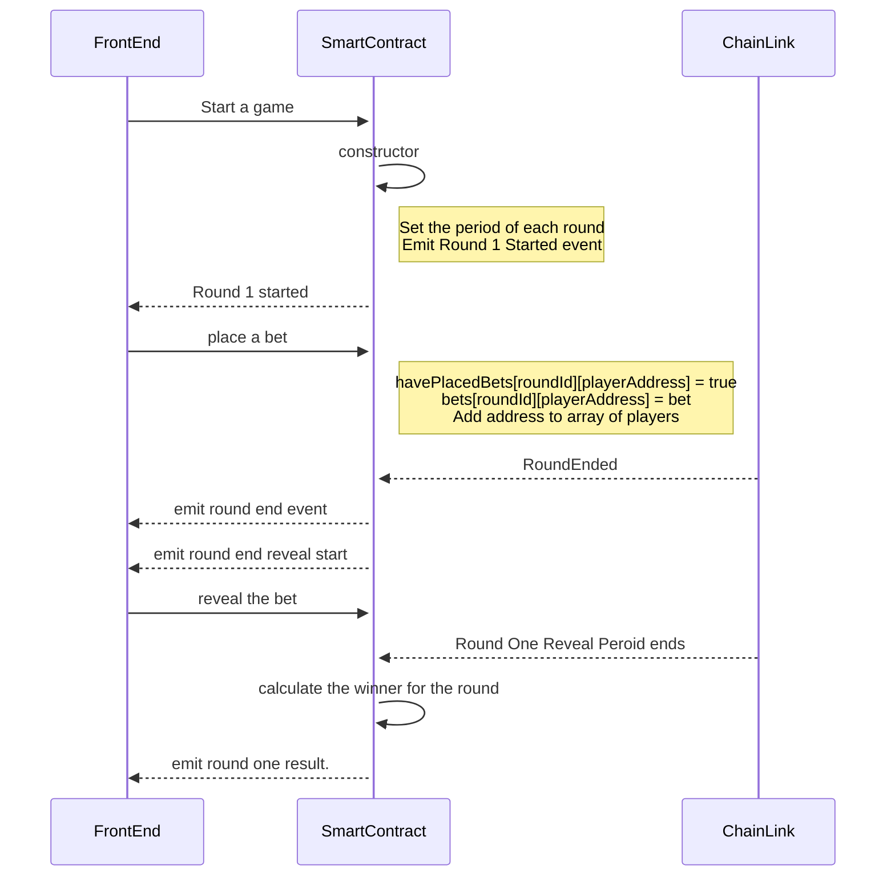

# CryptoJenga

## Chainlink features used
### price feed

yarn add @chainlink/contracts

```mermaid
sequenceDiagram
    participant FrontEnd
    participant SmartContract
    participant ChainLink

    FrontEnd->>+SmartContract: Start a game
    SmartContract->>SmartContract: constructor

    Note right of SmartContract: Set the period of each round<br/>Emit Round 1 Started event

    SmartContract -->> FrontEnd: Round 1 started

    FrontEnd ->> SmartContract: place a bet
    Note right of SmartContract: havePlacedBets[roundId][playerAddress] = true <br/>bets[roundId][playerAddress] = bet<br>Add address to array of players
    ChainLink-->>SmartContract: RoundEnded
    SmartContract-->>FrontEnd: emit round end event

   SmartContract-->>FrontEnd: emit round end reveal start
   FrontEnd->>SmartContract: reveal the bet

   ChainLink-->>SmartContract: Round One Reveal Peroid ends

   SmartContract->>SmartContract: calculate the winner for the round

    SmartContract-->>FrontEnd: emit round one result.
```
